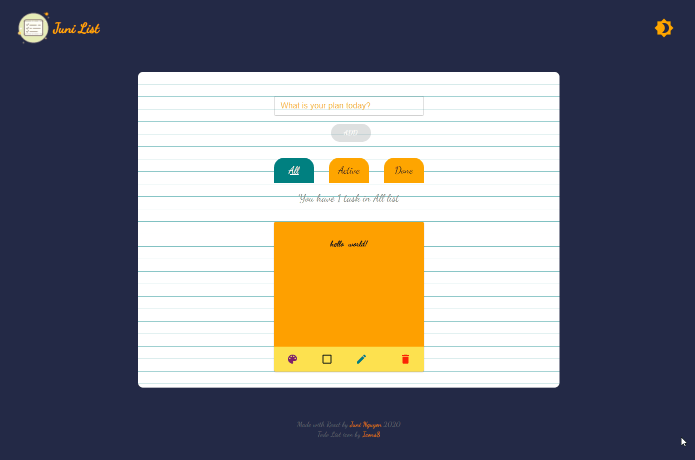

<!-- PROJECT SHIELDS -->

[![Contributors][contributors-shield]][contributors-url]
[![Forks][forks-shield]][forks-url]
[![Stargazers][stars-shield]][stars-url]
[![Issues][issues-shield]][issues-url]
[![MIT License][license-shield]][license-url]
[](https://app.netlify.com/sites/juni-todo-list/deploys)


<!-- MARKDOWN LINKS & IMAGES -->
<!-- https://www.markdownguide.org/basic-syntax/#reference-style-links -->
[contributors-shield]: https://img.shields.io/github/contributors/juniHub/todo-localstorage-v2.svg?style=for-the-badge
[contributors-url]: https://github.com/juniHub/todo-localstorage-v2/graphs/contributors
[forks-shield]: https://img.shields.io/github/forks/juniHub/todo-localstorage-v2.svg?style=for-the-badge
[forks-url]: https://github.com/juniHub/todo-localstorage-v2/network/members
[stars-shield]: https://img.shields.io/github/stars/juniHub/todo-localstorage-v2.svg?style=for-the-badge
[stars-url]: https://github.com/juniHub/todo-localstorage-v2/stargazers
[issues-shield]: https://img.shields.io/github/issues/juniHub/todo-localstorage-v2.svg?style=for-the-badge
[issues-url]: https://github.com/juniHub/todo-localstorage-v2/issues
[license-shield]: https://img.shields.io/github/license/juniHub/todo-localstorage-v2.svg?style=for-the-badge
[license-url]: https://github.com/juniHub/todo-localstorage-v2/blob/master/LICENSE.txt


<!-- PROJECT LOGO -->
<br />
<p align="center">
  <a href="https://github.com/juniHub/todo-react-v3
">
    
  </a>

  <h3 align="center">Juni Todo List V3</h3>

  <p align="center">
    project_description
    <br />
    <a href="https://github.com/juniHub/todo-react-v3
"><strong>Explore the docs »</strong></a>
    <br />
    <br />
    <a href="https://juni-todo-list.netlify.app/" target="_blank">View Demo</a>
    ·
    <a href="https://github.com/juniHub/todo-react-v3
/issues">Report Bug</a>
    ·
    <a href="https://github.com/juniHub/todo-react-v3
/issues">Request Feature</a>
  </p>
</p>


<!-- TABLE OF CONTENTS -->
<details open="open">
  <summary><h2 style="display: inline-block">Table of Contents</h2></summary>
  <ol>
    <li>
      <a href="#about-the-project">About The Project</a>
      <ul>
        <li><a href="#built-with">Built With</a></li>
      </ul>
    </li>
    <li>
      <a href="#getting-started">Getting Started</a>
      <ul>
        <li><a href="#prerequisites">Prerequisites</a></li>
        <li><a href="#installation">Installation</a></li>
      </ul>
    </li>
    <li><a href="#usage">Usage</a></li>
    <li><a href="#roadmap">Roadmap</a></li>
    <li><a href="#contributing">Contributing</a></li>
    <li><a href="#license">License</a></li>
    <li><a href="#contact">Contact</a></li>
  </ol>
</details>


<!-- ABOUT THE PROJECT -->
## About The Project




### Built With

* [ReactJS](https://reactjs.org/)
* [Material UI](https://material-ui.com/)
* [Local Storage](https://developer.mozilla.org/en-US/docs/Web/API/Window/localStorage)
* [Deployed on Netlify](https://www.netlify.com/)


<!-- GETTING STARTED -->
## Getting Started

To get a local copy up and running follow these simple steps.

### Prerequisites

This is an example of how to list things you need to use the software and how to install them.
* npm
  ```sh
  npm install npm@latest -g
  ```

### Installation

1. Clone the repo
   ```sh
   git clone https://github.com/juniHub/todo-react-v3.git
   ```
   
2. Install NPM packages
   ```sh
   npm install
   ```
   
3. Run the project locally on [http://localhost:3000](http://localhost:3000)

   ```sh
   npm run start
   ```


<!-- USAGE EXAMPLES -->
## Usage

_For more examples, please refer to the [Documentation](https://junitiennguyen.gitbook.io/todo-list). This will be continued for update and maintainance._

<!-- ROADMAP -->
## Roadmap

See the [open issues](https://github.com/juniHub/todo-react-v3/issues) for a list of proposed features (and known issues).


<!-- CONTRIBUTING -->
## Contributing

Contributions are what make the open source community such an amazing place to be learned, inspired, and created. Any contributions you make are **greatly appreciated**.

1. Fork the Project
2. Create your Feature Branch (`git checkout -b feature/AmazingFeature`)
3. Commit your Changes (`git commit -m 'Add some AmazingFeature'`)
4. Push to the Branch (`git push origin feature/AmazingFeature`)
5. Open a Pull Request


<!-- LICENSE -->
## License

Distributed under the MIT License. See `LICENSE` for more information.


<!-- CONTACT -->
## Contact

Juni Nguyen - [helloJuni](https://hellojuninguyen.netlify.app/)

Project Link: [https://github.com/juniHub/todo-react-v3](https://github.com/juniHub/todo-react-v3)


